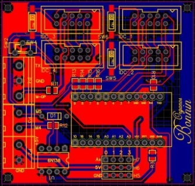
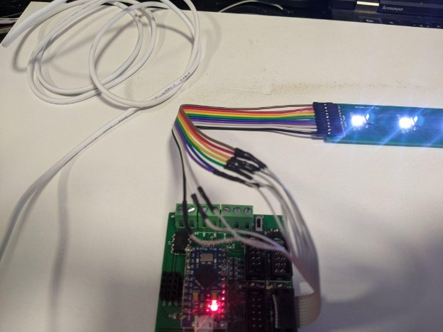
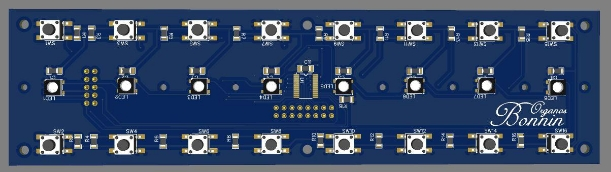



[**General Component Overview](#_jtclcdmnchy8)	**3**

[2 manual simple model](#_wvbw1qwb1oyi)	3

[**1.Cabinet](#_lmenqbukjjc5)	**4**

[2 manual simple model](#_xbyco7qo22da)	4

[1.1 Furniture boards](#_cyn0idyl5w5u)	4

[1.2 Kreg screws](#_1y62zlyjxjxu)	4

[1.3 Corner support](#_8poi4ixyvzm6)	4

[1.4 Base Foots](#_4weh9eut1fzo)	4

[1.4 Pedal Mechanisms](#_ojpr9ibqjbic)	4

[1.5 AC connection module](#_c8wng7psjurv)	4

[**2. Sound Generator](#_cszie4lpwn5o)	**5**

[2.1 Main Architecture options](#_oeml7gp5xn57)	5

[Raspberry Pi](#_wmru4rcdttia)	5

[X86 standard mainboards](#_4xq9ejntr71w)	5

[Orange Pi](#_6r40cessumr8)	5

[2.2 Sound output](#_vm0e8oeutw6j)	5

[USB DAC](#_hy7giobmbvy3)	5

[**3. External Sound System](#_fv2nrk7j9xa2)	**7**

[**4. Power Source](#_z04cl4ad4geh)	**8**

[**5. Operation Peripherals](#_u3cfc72ei66q)	**9**

[MIDI Controller board](#_m7de142v6pz4)	10

[Extension board 1](#_vcoyk94imxj8)	13

[Double array button board](#_3hgbb09f9544)	16

# General Component Overview
## 2 manual simple model

# 1.Cabinet
## 2 manual simple model

### 1.1 Furniture boards
### 1.2 Kreg screws
### 1.3 Corner support
### 1.4 Base Foots
### 1.4 Pedal Mechanisms
### 1.5 AC connection module
# 2. Sound Generator
## 2.1 Main Architecture options
### 2.1.1Raspberry Pi

(Recommeded 4GB/8GB)

### 2.1.2 X86 standard mainboards
### 2.1.2 Orange Pi
## 2.2 Sound output
### USB DAC
Pcm2704

# 3. External Sound System

# 4. Power Source

# 5. Operation Peripherals

## MIDI Controller board
This PCB has the system controller, the MIDI transceiver circuit, and the ports to which the keys will be attached. The PCB was made to be 63mm x 60mm. the SMD switches was added to enable further daisy chain connection for the NeoPixels resulting in using less pins in controlling the LEDs, and that is optional because each port is connected to a dedicated pin that controls the NeoPixels. Analog Pins was pinned out for further usage.

*Figure 1: 3D view of the MIDI controller board*

Controller Pinout

The schematic illustrates more how things are connected to each other.

*Figure 2:MIDI Controller schematic capture.*

… And here is the final layout.

*Figure 3: MIDI controller PCB layout.*
##
## Extension board 1

This board has the multiplexer IC 74HC4067 that passes the state of the selected channel, connected to it 8 keys out of 16, also mounted to the board WS2812 Neopixel LEDs connected in a daisy chain manner. The board has the bridge pin header connector to attach the second extension board. The board has auxiliary pins for debugging the states.

*Figure 4:3D view of the main extension board*

*Figure 5: Schematic capture for the main extension board.*

*Figure 6: PCB layout for the main extension board.*

**Extension board 2**

This board has the other 8 keys and Neopixels with auxiliary pins. It’s connected to the main extension board through female header.

*Figure 7: 3D view of the secondary extension board.*

*Figure 8: Schematic capture for the secondary extension board.*

*Figure 9: PCB layout of the secondary extension board.*
##
## Double array button board
This board has all 16 buttons on it connected to the multiplexer, with 8 NeoPixel LEDs connected in daisy chain, it also has a 10-pin IDC to be connected to the MIDI controller board. All channels were pinned out for debugging purposes.

*Figure 10: 3D view of the double array button board.*

*Figure 11: Schematic capture of the double array button board.*

*Figure 12: PCB layout of the double array button board.*

Links to open-source files and manufacturing files ...

MIDI controller:

Main Extension board:

Secondary Extension board:

Double array button board:

