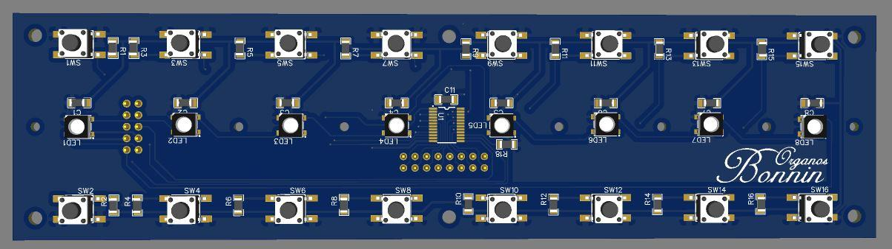
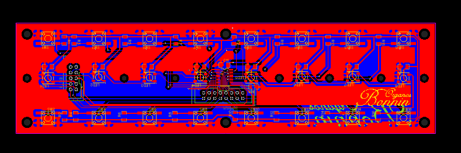
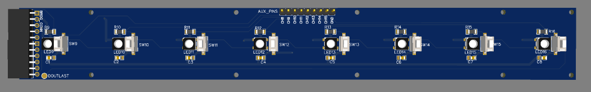
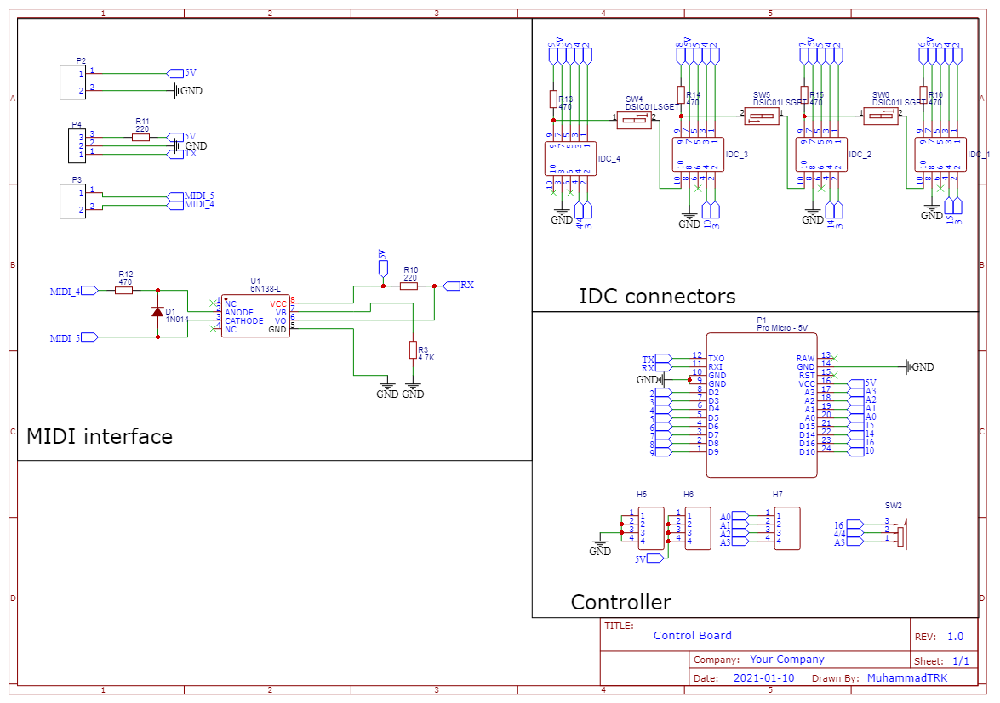

# About Openpipes

**Openpipes.org** is a full-stack open source Virtual Pipe Organ project. It involves all aspects of the instrument: from the cabinet to the controllers, pedalliers, and sound engine.

# General Structure of a Virtual Pipe Organ

# 1. The console

The virtual pipe organ console is the part of a pipe organ where the organist plays. It typically consists of:

* one or more **manuals**, which are the keyboards that the organist plays;
* the **pedalboard**, that the organist plays with their feet;
* a number of **stops**, which are **buttons** or **levers** that the organist uses to select which ranks of pipes will sound when a particular manual or the pedalboard is played;
* One or more **volume pedals**, that the organist uses to tune the audio level of a keyboard;
* Some **buttons** or **foot** **pistons **that the organist uses to activate particular functions.

The console is typically located near the keyboard and pedals, so that the organist can easily reach them while playing.

Some insights about carpentry: Melamine (MDF) and real wood

**Melamine MDF** is a type of _medium-density fiberboard_ (MDF) that has been coated with a thin layer of melamine plastic. Melamine is a type of synthetic resin that is often used in the manufacture of laminate surfaces for furniture and other products. When applied to MDF, it creates a smooth, hard surface that is resistant to stains, moisture, and heat. Melamine MDF is commonly used for the construction of cabinets, shelving, and other furniture products because of its durability and ease of maintenance.

Melamine vs real wood

is a type of engineered wood that is made from wood fibers that are bound together with a synthetic resin. It is a durable and cost-effective material that is often used for making furniture, cabinets, and other products. Real wood, on the other hand, is made from solid wood and is considered to be a natural and more premium material.

MDF advantages:

1. MDF is more affordable than real wood. Because it is made from recycled wood fibers and is less labor-intensive to produce, MDF is generally less expensive than solid wood;
2. MDF is easier to work with than real wood. Because it is made from recycled wood fibers and is less labor-intensive to produce, MDF is generally less expensive than solid wood;

Real wood advantages:

There are several advantages to using real wood over MDF (medium-density fiberboard), including the following:

* Real wood is more durable and long-lasting than MDF;
* Real wood is natural material, while MDF is a man-made composite;
* Real wood is more resistant to changes in temperature and humidity than MDF;
* Real wood has a natural warmth and beauty that many people prefer over the uniform, smooth surface of MDF;
* Real wood can be sanded and refinished, while MDF cannot be sanded without damaging its surface.

Overall, the main advantage of real wood is that it is a natural, durable, and long-lasting material that can add warmth and beauty to a space. MDF, on the other hand, is a man-made composite that is less durable and less resistant to changes in temperature and humidity.

# Cabinet main structure per model

## Portative model

This is a 61 keys portable model, with the capacity of having an embedded device, as a Raspberry Pi, and a normal Mini ITX motherboard. It also has enough space for hosting an amplifier and speakers.

Portative Model Plan:

## 2 manuals minimal model

This is a 2 manuals model of modest sizes, which can be built with only 1 sheet of material (of 1.8m x 2.6m)

## 

## 2 manuals extended model

This model is 1.30m wide, so it supports a full-size pedalboard.

## 3 manuals flexible organ

## 

## 

# 2. The pedalboard

A pipe organ pedalboard is a type of keyboard that is played with the feet. It is typically used to play the bass notes of the organ, and it is usually located in front of the organist, either on the floor or on a separate stand. The pedalboard typically has around 30 pedals, arranged in a similar fashion to the keys on a piano. Some pedalboards have fewer or more pedals, depending on the needs of the specific organ. The pedals are used to control the flow of air to the pipes of the organ, allowing the organist to play a wide range of bass notes and create a full, rich sound.

# Volume pedals and foot pistons

## Hall sensors

The volume pedals include hall sensors for reading the volumes.

A Hall effect sensor, or a Hall effect switch, is a device that uses the Hall effect to measure magnetic fields. It consists of a thin piece of rectangular p-doped semiconductor material, such as gallium arsenide, positioned between two parallel plates. When a magnetic field is applied perpendicular to the plates, the electrons in the semiconductor material are deflected, resulting in a potential difference or voltage across the plates. This voltage can be measured and used to determine the strength and direction of the magnetic field.

Hall effect sensors are commonly used to measure magnetic fields in a wide range of applications, including automotive sensors, industrial motors, and medical equipment. The E49 hall sensor is a specific type of Hall effect sensor that is often used in position sensing and proximity sensing applications.

The E49 hall sensor has a sensitivity of 1.5 to 4.5 mV/G, which means that it produces a voltage output of 1.5 to 4.5 millivolts per gauss of magnetic field strength. This allows it to accurately measure magnetic fields over a wide range of strengths. The sensor also has a fast response time, making it suitable for applications that require high-speed measurements. Additionally, the E49 hall sensor has a high operating temperature range, allowing it to be used in environments where the temperature may vary greatly.

# 3. Sound Generation engine

## Embedded system

## Raspberry Pi

A Raspberry Pi is a small, single-board computer that was first developed in the United Kingdom as a low-cost way of promoting computer science education. It is about the size of a credit card, and it can be used for a wide range of purposes, including as a home theater PC, a media server, a retro gaming console, and more. 

As a musician, you could use a Raspberry Pi to create your own digital music studio, or to build a custom synthesizer or drum machine. The Raspberry Pi is a powerful and versatile tool that can help you explore your musical ideas and bring them to life.

## X86 PC-based system

### X86 standard mainboard

A standard x86 mainboard is the central component of a computer that holds the CPU, memory, and other components that make up a computer system. It is also known as a motherboard or a system board. The motherboard is the largest and most important circuit board in a computer, as it provides the connections and pathways that allow all of the other components to communicate with each other.

# 4. Power Source

## 4.1 X86 based system: AC/DC power source

A AC/DC power source is a device that can provide either alternating current (AC) or direct current (DC) power. AC power is the type of power commonly used in households and DC power is the type of power used in most electronic devices. AC/DC power sources can be used to convert AC power into DC power or vice versa. Some common characteristics of AC/DC power sources include their ability to provide power at different voltages and their ability to be easily switched between AC and DC modes.

## 4.2 X86 based Engine: ATX power source

An ATX power supply is a type of power supply unit (PSU) that is commonly used in desktop computers. ATX power supplies are typically designed to provide power to the motherboard, CPU, and other internal components of a computer, as well as any attached peripherals such as hard drives, optical drives, and fans.

ATX power supplies are characterized by their rectangular shape and standard connectors, which allow them to be easily installed into a computer case. The main characteristics of ATX power supplies include their ability to provide a steady and reliable source of power to the various components of a computer, as well as their ability to automatically turn on and off in response to changes in the power requirements of the system.

ATX power supplies typically have a 20-pin or 24-pin main power connector that plugs into the motherboard, as well as several additional connectors for supplying power to other components. Some common connectors found on ATX power supplies include 4-pin or 8-pin auxiliary power connectors for the CPU, Molex connectors for supplying power to hard drives and optical drives, and SATA connectors for supplying power to newer storage devices.

Overall, the ATX power supply is a critical component of any desktop computer, as it provides the power needed to keep all of the internal components running smoothly.

### Main boards

X86 boards

An x86 mainboard is typically rectangular in shape and has a series of slots and connectors on it for attaching various components, such as the CPU, memory, and expansion cards. The motherboard also has a series of chips and other components that control how the computer functions, such as the BIOS, which controls the basic input/output functions of the computer, and the southbridge, which controls communication between the CPU and other components.

It is a type of motherboard that is designed to support processors based on the x86 instruction set, which is a common instruction set used in modern computer processors. A typical x86 motherboard consists of several key components, including a central processing unit (CPU) socket, memory slots, expansion slots, storage interfaces, and various connectors and ports.

The CPU socket is a special slot on the motherboard that is designed to hold the processor. This socket is specifically designed to match the physical and electrical characteristics of the CPU, and it allows the processor to be securely installed onto the motherboard.

Next, the memory slots are used to hold memory modules, such as DDR4 DIMMs. These slots allow the motherboard to access the installed memory modules and use their data to store and retrieve information.

Expansion slots, such as PCI Express (PCIe) slots, are used to add additional hardware to the system. For example, a graphics card can be installed into a PCIe slot to improve the system's ability to display high-resolution graphics.

Storage interfaces, such as SATA and M.2, allow the motherboard to connect to storage devices such as hard drives and solid-state drives. These interfaces provide a fast and reliable way to access data stored on these devices.

Finally, the motherboard also has various connectors and ports that allow it to connect to other devices and peripherals. For example, it may have USB ports for connecting external devices, Ethernet ports for connecting to a network, and audio jacks for connecting speakers or headphones.

Overall, these are the key components of an x86 motherboard. Together, they provide the foundation for a computer system, allowing the processor, memory, and other components to work together to perform various tasks.

Raspberry Pi Board

it has a Broadcom BCM2837B0, Cortex-A53 (ARMv8) 64-bit SoC @ 1.4GHz processor and 1GB to *GB  of LPDDR2 SDRAM. The Raspberry Pi 4 Model B has a maximum power consumption of 5V at 3A, and it has several I/O ports, including HDMI, USB, Ethernet, and a 3.5mm audio jack. It also has a microSD card slot for storage, and it supports a wide range of operating systems, including Raspberry OS, a Debian-based Linux operating system. 

From the OpenPipes.org project, you can get a specially tailored Raspberry OS, which will provide you with all the preinstalled software you need to run your VPO, called Pipebian.

## Sound output boards

#### USB DAC

Sure! A USB DAC, or Digital-to-Analog Converter, is a device that converts digital audio signals into analog audio signals. This is important for musicians because many computers, laptops, and other devices output audio in a digital format, but most musical instruments and audio equipment are designed to work with analog signals. A USB DAC allows a musician to connect their computer to a musical instrument or audio equipment and play or record music.

Here's how it works: when you play a digital audio file on your computer, the DAC converts the digital audio signal into an analog signal that can be sent to an amplifier or other audio equipment. This analog signal is then sent to the musical instrument or audio equipment, where it is used to create sound.

In addition to its basic function of converting digital audio signals to analog, a USB DAC may also have additional features that can be useful for musicians. For example, some USB DACs include an **amplifier**, which can boost the signal and improve the quality of the sound. Other USB DACs support **high-resolution audio**, which can provide a more detailed and nuanced listening experience.

Overall, a USB DAC is a useful tool for musicians who want to connect their computer to a musical instrument or audio equipment and play or record music. It allows them to take advantage of the convenience and versatility of digital audio while still being able to use their analog equipment.

#### The PCM 2704 CHIP

The PCM2704 is a chip that is used in some audio devices, such as USB sound cards, as a digital-to-analog converter (DAC). This chip allows the device to convert digital audio signals into analog signals that can be played through speakers or headphones. The PCM2704 is known for its high-quality audio performance, making it a popular choice for musicians who want to ensure that their music is reproduced accurately. It can support sample rates up to 48 kHz and has a dynamic range of up to 90 dB. Overall, the PCM2704 is a useful chip for musicians who want to ensure that their digital audio is converted into high-quality analog audio.

# The Linux Operating system

Specialized Linux distros

Pipebian

86Pipes

Pipe Organ emulating software

#### GrandOrgue

GrandOrgue is a free and open-source virtual pipe organ software that allows users to build and play virtual pipe organs on their computers. It is popular among pipe organ enthusiasts and musicians who want to practice and learn about the instrument. The software is highly customizable and allows users to create their own virtual pipe organs using samples of real pipe organs. It also includes a wide variety of pre-built organs that users can play and experiment with. It is also the base for the Openpipes distribution.

Jorgan

Aeolus

# 3. Speaker System

An **active speaker system** is a type of audio system that includes built-in amplifiers. This means that the speakers are self-powered, and do not require an external amplifier or receiver to operate. The amplifiers are typically built into the speaker enclosure, which allows for a more compact and self-contained design. 

This is in contrast to a **passive speaker system**, which relies on an external amplifier to power the speakers. Active speaker systems are often used in home theater systems and other audio setups where space is at a premium, or where simplicity and convenience are important.

Bookshelf active speaker systems are a type of audio system that consists of a set of small, self-contained speakers that are designed to be placed on a bookshelf or another similar surface. Unlike traditional speakers, which require an external amplifier to power them, bookshelf active speakers have a built-in amplifier that allows them to be used without any additional equipment. This makes them a convenient and easy-to-use option for people who want to listen to music, movies, or other audio content in their homes. Because of their compact size, bookshelf active speakers are also often a good choice for people who have limited space for their audio equipment.

# 5. Changing the sound: Buttons and Pedals

## Arduino: The Open source solution for creating controllers

What is Arduino?

Arduino is a type of open-source hardware and software that is used for building electronic projects. It was originally developed for hobbyists and students, but has since been used in a wide range of applications, from robotic projects to home automation systems. Arduino boards consist of a microcontroller and a number of input/output pins that can be used to connect sensors, actuators, and other electronic components. 

The Arduino software, which is free and open-source, allows users to easily write and upload code to the board, making it a popular choice for quickly prototyping and building electronic projects.

Arduino is a popular platform for building electronic projects because it is relatively easy to use, even for those with little experience in electronics or programming. Arduino boards are small and compact, making them well-suited for a variety of projects. They are also quite inexpensive, which makes them a good choice for hobbyists and students on a budget.

The Arduino software, which is called the **Arduino Integrated Development Environment (IDE)**, is free and open-source. This means that anyone can download and use it, as well as modify and distribute it. The Arduino IDE is available for Windows, macOS, and Linux. It includes a text editor for writing code, a compiler for turning that code into instructions that the Arduino board can understand, and a debugger for finding and fixing errors in the code.

The Arduino board itself consists of a microcontroller, which is a small computer that can run a single program at a time. The microcontroller is the "brain" of the Arduino board, and it is responsible for executing the instructions in the code that is uploaded to it. The board also has a number of input/output (I/O) pins, which can be used to connect the board to other electronic components. These components might include sensors, such as a temperature sensor or a light sensor, or actuators, such as a motor or a LED.

Once the Arduino board is connected to these components, the user can write code to control the components, read data from the sensors, and perform a wide variety of other tasks. The code is written in the Arduino programming language, which is based on C++, and is designed to be easy to learn and use. Once the code is written, it can be uploaded to the Arduino board using a USB cable, and the board will immediately begin executing the instructions in the code.

In summary, Arduino is a popular platform for building electronic projects because it is easy to use, inexpensive, and flexible. It consists of both hardware (the Arduino board) and software (the Arduino IDE), and allows users to quickly prototype and build a wide variety of projects, from simple home automation systems to complex robotics projects.

Some of the most common Arduino boards include the Arduino Uno, Arduino Nano, Arduino Mega, Arduino Mini, Arduino Pro Mini, and Arduino Pro Micro. Each of these boards has its own unique set of features and capabilities, and is suited to different types of projects. For example, the Arduino Uno is a popular all-purpose board that is great for beginners, while the Arduino Mega is a larger board with more I/O pins and memory, making it suitable for more complex projects.

## OpenPipes Chosen platform: Arduino Pro Micro

An Arduino Pro Micro is a small microcontroller board based on the ATmega32U4 microcontroller. It has 20 digital input/output pins, a 16 MHz crystal oscillator, a micro USB connection, a power jack, an ICSP header, and a reset button. It is designed to be easily used in DIY electronics projects, and can be programmed using the Arduino software development environment. It is also compatible with many other external hardware components and libraries, making it a versatile and powerful tool for building a wide range of electronic devices.

## Developing Arduino Programs: The Arduino IDE.

The Arduino Integrated Development Environment (IDE) is a free software application that you can use to write and upload code to an Arduino board. The Arduino IDE supports C and C++ programming languages and provides a simple and easy-to-use interface for writing and uploading code to an Arduino board. It also includes a built-in code editor, a debugger, and other features that can help you develop and test your Arduino projects.

The Arduino IDE is a popular choice for many Arduino users, as it is easy to use and provides a wide range of features that can help you develop your projects quickly and easily. It is also open source, which means that anyone can contribute to its development and improve its features. Overall, the Arduino IDE is an essential tool for anyone who wants to work with Arduino boards and create their own electronic projects.

Installing the Arduino IDE

To install the Arduino IDE on your computer, follow these steps:

1. Go to the Arduino website ([https://www.arduino.cc/](https://www.arduino.cc/)).
2. Click on the "Software" tab and then select "Download the Arduino IDE" from the drop-down menu.
3. Select the appropriate version of the Arduino IDE for your operating system.
4. Once the download is complete, open the downloaded file and follow the prompts to install the Arduino IDE on your computer.

After the installation is complete, you can open the Arduino IDE by double-clicking on its icon. You can then connect your Arduino board to your computer using a USB cable and start using the Arduino IDE to write and upload code to your board.

Note: The Arduino IDE is available for Windows, MacOS, and Linux operating systems.

### Creating simple programs and loading them into the Arduino Nano

## Emulating A Midi device with the Arduino Nano

To emulate a MIDI USB device using an Arduino Pro Micro, you will need to install a third-party library called "MIDIUSB" that adds support for MIDI communication over USB to the Arduino. Once the library is installed, you can use the MIDIUSB library functions in your Arduino code to send and receive MIDI messages over the USB connection. You will also need to connect the Arduino to a computer using a USB cable, and configure the computer to recognize the Arduino as a MIDI device.

Here are some more details on how to use an Arduino Pro Micro to emulate a MIDI USB device:

1. First, you will need to download and install the MIDIUSB library for Arduino. This library adds support for MIDI communication over USB to the Arduino, allowing it to send and receive MIDI messages. You can download the library from the official Arduino website or from the GitHub page for the MIDIUSB library.
2. Once the library is installed, you can start using it in your Arduino code. To do this, you will need to include the MIDIUSB library at the top of your code using the #include preprocessor directive, and then create a MIDI_CREATE_DEFAULT_INSTANCE object in your code. This object will allow you to access the MIDIUSB library functions and use them to send and receive MIDI messages.
3. To send a MIDI message, you can use the midiEventPacket function, which takes the MIDI message type, channel, and data as arguments. For example, to send a MIDI note on message with a note value of 60 on channel 1, you could use the following code:

midiEventPacket(MIDI_NOTE_ON, 1, 60);

1. To receive MIDI messages, you can use the midiEventPacket function in a similar way, but this time you will also need to specify a callback function that will be executed whenever a MIDI message is received. The callback function should take the MIDI message type, channel, and data as arguments, and you can use this information to process the incoming MIDI message in your code. For example, the following code will print the received MIDI message to the serial console:

void onMidiMessage(uint8_t type, uint8_t channel, uint8_t data) {

  Serial.print("Received MIDI message: type=");

  Serial.print(type);

  Serial.print(", channel=");

  Serial.print(channel);

  Serial.print(", data=");

  Serial.println(data);

}

void setup() {

  // Initialize the serial console

  Serial.begin(9600);

  

  // Register the callback function to be executed when a MIDI message is received

  MIDI.setHandleNoteOn(onMidiMessage);

1. Finally, to configure the computer to recognize the Arduino as a MIDI device, you will need to install a USB-MIDI driver on the computer. Most computers will automatically install the necessary drivers when the Arduino is connected, but if this doesn't happen, you can download and install the appropriate driver from the Arduino website or from the website of the USB-MIDI device manufacturer. Once the driver is installed, the computer should recognize the Arduino as a MIDI device, and you can use it to send and receive MIDI messages in your music software.

## Reaching for inputs: The 74HC4067 Multiplexer

The 74HC4067 is a 16-channel multiplexer, which means that it can be used to select and route one of 16 input signals to a single output. This is useful when you want to switch between a large number of signals but only have a limited number of available connections.

Each channel on the 74HC4067 is controlled by a separate "select" line, allowing the user to choose which input signal should be routed to the output. The chip also has an "enable" line that can be used to turn the multiplexer on or off.

In the context of music, the 74HC4067 could be used to switch between different instruments or signals in a performance. For example, a musician could use the multiplexer to quickly switch between different guitar effects pedals or to select different audio sources during a live performance.

Overall, the 74HC4067 is a useful device for anyone who needs to switch between a large number of signals in a compact and efficient manner.

## Displaying information using light: The Neopixel ws2812B

### What’s a Neopixel?

A neopixel is a type of LED light that can be used in a variety of applications, including in music and visual performances. Unlike traditional LEDs, which can only produce a single color of light, neopixels are capable of producing a wide range of colors and can be controlled individually to create complex visual effects. 

Each LED in a NeoPixel strip has its own integrated circuit that allows it to receive and interpret data transmitted over a single wire. This allows for precise control over the color and brightness of each LED individually.

Some of the key properties of WS2812B NeoPixels include:

* The LEDs are individually addressable, which means they can be controlled individually or in groups.
* They can produce a wide range of colors, including shades of red, green, and blue.
* The LEDs have a high refresh rate, which means they can be used to create smooth, animated lighting effects.
* They are relatively easy to use (They need only one pin for communication, and are connected in series) , with a wide range of libraries and tutorials available to help you get started.

Overall, WS2812B NeoPixels are a popular choice for creating interactive lighting displays and other visual effects.

Musicians often use neopixels in their performances to add an additional layer of visual interest to their music. For example, a musician might use a neopixel light strip to create a dynamic light show that changes in time with the music.

Here you have a simple example for Arduino:

#include <Adafruit_NeoPixel.h>

const int LED_PIN = 2;  // Pin where the neopixel is connected

const int LED_COUNT = 1;  // Number of neopixels in your strip

// Initialize the neopixel library

Adafruit_NeoPixel pixels = Adafruit_NeoPixel(LED_COUNT, LED_PIN, NEO_GRB + NEO_KHZ800);

void setup() {

  pixels.begin();  // Initialize the neopixel library

}

void loop() {

  pixels.setPixelColor(0, pixels.Color(255, 0, 0));  // Set the first neopixel to red

  pixels.show();  // Send the updated pixel colors to the neopixel strip

}

## The OpenPipes hardware controller

## Main Controller board

This PCB has the system controller, the MIDI transceiver circuit, and the ports to which the keys will be attached. The PCB was made to be 63mm x 60mm. the SMD switches was added to enable further daisy chain connection for the NeoPixels resulting in using less pins in controlling the LEDs, and that is optional because each port is connected to a dedicated pin that controls the NeoPixels. Analog Pins was pinned out for further usage. 

_Figure 1: 3D view of the MIDI controller board_

To read 16 buttons from an Arduino Pro Micro using a 74HC4067, you will need to connect the 74HC4067 to the Arduino using the following steps:

1. Connect the VCC pin on the 74HC4067 to the 5V power pin on the Arduino.
2. Connect the GND pin on the 74HC4067 to the GND pin on the Arduino.
3. Connect the S0-S3 pins on the 74HC4067 to digital pins on the Arduino. These pins will be used to select which input you want to read from the 74HC4067.
4. Connect the Y0-Y15 pins on the 74HC4067 to the buttons you want to read. Each button should be connected to a different Y pin on the 74HC4067.
5. In your Arduino code, use the digitalWrite() function to select the input you want to read from the 74HC4067. For example, to read from the Y0 pin, you would set S0-S3 to binary "0000".
6. Use the digitalRead() function to read the value from the selected input. This will return either HIGH or LOW, depending on whether the button is pressed or not.

You can use these steps to read multiple buttons and create more complex input controls for your Arduino projects.

To read a voltage from a E49 hall sensor in Arduino, you can follow these steps:

1. Connect the E49 hall sensor to the Arduino. The E49 hall sensor has three pins: VCC, GND, and OUT. Connect the VCC pin to a 5V power supply on the Arduino, the GND pin to a ground pin on the Arduino, and the OUT pin to an analog input pin on the Arduino.
2. In your Arduino sketch, use the analogRead() function to read the voltage from the analog input pin that is connected to the E49 hall sensor. This function returns a value between 0 and 1023, representing the voltage on the analog input pin.
3. Convert the value returned by the analogRead() function to a voltage value by using the following formula:
1. Use the voltage value to determine the strength of the magnetic field that is being measured by the E49 hall sensor. The voltage output of the E49 hall sensor is proportional to the strength of the magnetic field, so a higher voltage indicates a stronger magnetic field, and a lower voltage indicates a weaker magnetic field.

#### Controller Pinout

The schematic illustrates more how things are connected to each other.

_Figure 2:MIDI Controller schematic capture._

## Double array button board

This board has all 16 buttons on it connected to the multiplexer, with 8 NeoPixel LEDs connected in daisy chain, it also has a 10-pin IDC to be connected to the MIDI controller board. All channels were pinned out for debugging purposes.

_Figure 10: 3D view of the double array button board._

_Figure 12: PCB layout of the double array button board._

## RGB Thumb Button Boards

This board has the multiplexer IC 74HC4067 that passes the state of the selected channel, connected to it 8 keys out of 16, also mounted to the board WS2812 Neopixel LEDs connected in a daisy chain manner. The board has the bridge pin header connector to attach the second extension board. The board has auxiliary pins for debugging the states.

_Figure 4:3D view of the main extension board_

_Figure 7: 3D view of the secondary extension board._

_Figure 8: Schematic capture for the secondary extension board._

# Appendix 1: Detailed console plans

Portative model

2 manuals model

3 manuals model

