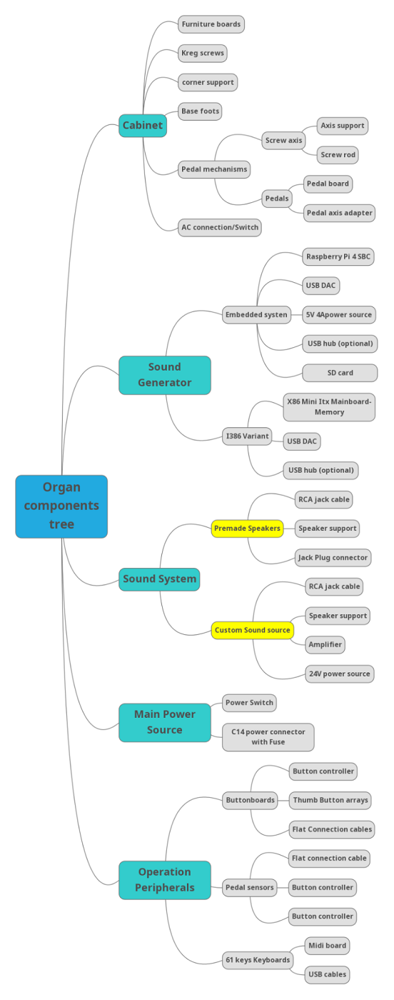

<div>

[]{.c1}

</div>

[Building your own Virtual Pipe Organ]{.c20 .c28}

[]{.c20 .c28}

[Open Source Edition]{.c28 .c50}

[]{.c50 .c28}

[{style="width: 359.00px; height: 298.72px; margin-left: 0.00px; margin-top: -58.41px; transform: rotate(0.00rad) translateZ(0px); -webkit-transform: rotate(0.00rad) translateZ(0px);"}]{style="overflow: hidden; display: inline-block; margin: 0.00px 0.00px; border: 0.00px solid #000000; transform: rotate(0.00rad) translateZ(0px); -webkit-transform: rotate(0.00rad) translateZ(0px); width: 359.00px; height: 165.59px;"}

------------------------------------------------------------------------

[Index]{.c20 .c28}

[[About
Openpipes](#h.jmg69ulcl0gh){.c6}]{.c2}[        ]{.c2}[[4](#h.jmg69ulcl0gh){.c6}]{.c17}

[[General Structure of a Virtual Pipe
Organ](#h.yu8kgegtkg6a){.c6}]{.c17}[        ]{.c17}[[5](#h.yu8kgegtkg6a){.c6}]{.c17}

[[1. The
Console](#h.lmenqbukjjc5){.c6}]{.c17}[        ]{.c17}[[6](#h.lmenqbukjjc5){.c6}]{.c17}

[[Cabinet main structure per
model](#h.z18rl3r0u1hc){.c6}]{.c21}[        ]{.c21}[[8](#h.z18rl3r0u1hc){.c6}]{.c21}

[[Portative
model](#h.i1a2owjvdeuq){.c6}]{.c2}[        ]{.c2}[[8](#h.i1a2owjvdeuq){.c6}]{.c2}

[[2 manuals minimal
model](#h.bl8svxhsx2ao){.c6}]{.c2}[        ]{.c2}[[10](#h.bl8svxhsx2ao){.c6}]{.c2}

[[2 manuals extended
model](#h.ooefpfhvhflb){.c6}]{.c2}[        ]{.c2}[[11](#h.ooefpfhvhflb){.c6}]{.c2}

[[3 manuals flexible
organ](#h.izprxl8juq7z){.c6}]{.c2}[        ]{.c2}[[12](#h.izprxl8juq7z){.c6}]{.c2}

[[2. The
pedalboard](#h.1enkacycz5z0){.c6}]{.c17}[        ]{.c17}[[13](#h.1enkacycz5z0){.c6}]{.c17}

[[Volume pedals and foot
pistons](#h.igydxzvk2b2g){.c6}]{.c2}[        ]{.c2}[[13](#h.igydxzvk2b2g){.c6}]{.c17}

[[Hall
sensors](#h.im9fzn7g0ca0){.c6}]{.c2}[        ]{.c2}[[13](#h.im9fzn7g0ca0){.c6}]{.c2}

[[3. Sound Generation
engine](#h.cszie4lpwn5o){.c6}]{.c17}[        ]{.c17}[[14](#h.cszie4lpwn5o){.c6}]{.c17}

[[Embedded system / Raspberry
Pi](#h.rbgokcmbmzn2){.c6}]{.c2}[        ]{.c2}[[14](#h.rbgokcmbmzn2){.c6}]{.c2}

[[X86 PC-based
system](#h.qjzeiixbw0pa){.c6}]{.c2}[        ]{.c2}[[15](#h.qjzeiixbw0pa){.c6}]{.c2}

[[X86 standard
mainboard](#h.51949pujwvwn){.c6}]{.c2}[        ]{.c2}[[15](#h.51949pujwvwn){.c6}]{.c2}

[[4. Power
Source](#h.z04cl4ad4geh){.c6}]{.c17}[        ]{.c17}[[15](#h.z04cl4ad4geh){.c6}]{.c17}

[[X86 based system: AC/DC power
source](#h.ud9htccnlav6){.c6}]{.c2}[        ]{.c2}[[15](#h.ud9htccnlav6){.c6}]{.c2}

[[X86 based Engine: ATX power
source](#h.imc9xi866mko){.c6}]{.c2}[        ]{.c2}[[16](#h.imc9xi866mko){.c6}]{.c2}

[[Main
boards](#h.9h1qts5kg9nr){.c6}]{.c2}[        ]{.c2}[[16](#h.9h1qts5kg9nr){.c6}]{.c2}

[[Sound output
boards](#h.vm0e8oeutw6j){.c6}]{.c2}[        ]{.c2}[[17](#h.vm0e8oeutw6j){.c6}]{.c2}

[[USB
DAC](#h.hy7giobmbvy3){.c6}]{.c2}[        ]{.c2}[[17](#h.hy7giobmbvy3){.c6}]{.c2}

[[The PCM 2704
CHIP](#h.rpbvcmrhp41r){.c6}]{.c2}[        ]{.c2}[[18](#h.rpbvcmrhp41r){.c6}]{.c2}

[[The Linux Operating
system](#h.fv2nrk7j9xa2){.c6}]{.c17}[        ]{.c17}[[19](#h.fv2nrk7j9xa2){.c6}]{.c17}

[[GrandOrgue](#h.85idkwg6ptfl){.c6}]{.c2}[        ]{.c2}[[19](#h.85idkwg6ptfl){.c6}]{.c2}

[[3. Speaker
System](#h.i73whrn6fvrt){.c6}]{.c17}[        ]{.c17}[[19](#h.i73whrn6fvrt){.c6}]{.c17}

[[5. Changing the sound: Buttons and
Pedals](#h.u3cfc72ei66q){.c6}]{.c17}[        ]{.c17}[[21](#h.u3cfc72ei66q){.c6}]{.c17}

[[Arduino: The Open source solution for creating
controllers](#h.m7de142v6pz4){.c6}]{.c2}[        ]{.c2}[[22](#h.m7de142v6pz4){.c6}]{.c2}

[[OpenPipes Chosen platform: Arduino Pro
Micro](#h.p80fcgsezzf9){.c6}]{.c2}[        ]{.c2}[[23](#h.p80fcgsezzf9){.c6}]{.c2}

[[Developing Arduino Programs: The Arduino
IDE.](#h.nuettjanzzxk){.c6}]{.c2}[        ]{.c2}[[23](#h.nuettjanzzxk){.c6}]{.c2}

[[Creating simple programs and loading them into the Arduino
Nano](#h.ef99pwlse9ft){.c6}]{.c2}[        ]{.c2}[[24](#h.ef99pwlse9ft){.c6}]{.c2}

[[Emulating A Midi device with the Arduino
Nano](#h.rz9q3zjgijtr){.c6}]{.c2}[        ]{.c2}[[24](#h.rz9q3zjgijtr){.c6}]{.c2}

[[Reaching for inputs: The 74HC4067
Multiplexer](#h.ibiyfmdxc763){.c6}]{.c2}[        ]{.c2}[[26](#h.ibiyfmdxc763){.c6}]{.c2}

[[Displaying information using light: The Neopixel
ws2812B](#h.euk6evjcxta6){.c6}]{.c2}[        ]{.c2}[[26](#h.euk6evjcxta6){.c6}]{.c2}

[[What's a
Neopixel?](#h.hnszxec45amk){.c6}]{.c2}[        ]{.c2}[[26](#h.hnszxec45amk){.c6}]{.c2}

[[The OpenPipes hardware
controller](#h.3plfp6mufqjc){.c6}]{.c2}[        ]{.c2}[[28](#h.3plfp6mufqjc){.c6}]{.c2}

[[Main Controller
board](#h.gm92u2frueyc){.c6}]{.c2}[        ]{.c2}[[28](#h.gm92u2frueyc){.c6}]{.c2}

[[Controller
Pinout](#h.3h1htdu9rknw){.c6}]{.c2}[        ]{.c2}[[30](#h.3h1htdu9rknw){.c6}]{.c2}

[[Double array button
board](#h.qcx5hr4z1chz){.c6}]{.c2}[        ]{.c2}[[32](#h.qcx5hr4z1chz){.c6}]{.c2}

[[RGB Thumb Button
Boards](#h.vcoyk94imxj8){.c6}]{.c2}[        ]{.c2}[[33](#h.vcoyk94imxj8){.c6}]{.c2}

[[Appendix 1: Detailed console
plans](#h.k8e9ndjykwvg){.c6}]{.c17}[        ]{.c17}[[38](#h.k8e9ndjykwvg){.c6}]{.c17}

------------------------------------------------------------------------

[]{.c20 .c28}

# [About Openpipes]{.c20 .c23} {#h.jmg69ulcl0gh .c5}

[Openpipes.org]{.c21}[ is a full-stack open source Virtual Pipe Organ
project. It involves all aspects of the instrument: from the cabinet to
the controllers, pedalliers, and sound engine.]{.c2}

------------------------------------------------------------------------

[]{.c10}

# [General Structure of a Virtual Pipe Organ]{.c20 .c31} {#h.yu8kgegtkg6a .c27 .c58}

[{style="width: 295.92px; height: 748.50px; margin-left: 0.00px; margin-top: 0.00px; transform: rotate(0.00rad) translateZ(0px); -webkit-transform: rotate(0.00rad) translateZ(0px);"}]{style="overflow: hidden; display: inline-block; margin: 0.00px 0.00px; border: 0.00px solid #000000; transform: rotate(0.00rad) translateZ(0px); -webkit-transform: rotate(0.00rad) translateZ(0px); width: 295.92px; height: 748.50px;"}

# [1. ]{.c35}[The console]{.c20 .c31} {#h.lmenqbukjjc5 .c27 .c60}

[]{.c1}

[The]{.c16}[ virtual pipe organ console is the part of a pipe organ
where the organist plays. It typically consists of:]{.c13}

[]{.c13}

-   [one or more ]{.c16}[manuals]{.c57}[, which are the keyboards that
    the organist plays;]{.c13}

[]{.c13}

-   [the ]{.c16}[pedalboard]{.c57}[, that the organist plays with their
    feet;]{.c13}

[]{.c13}

-   [a number of ]{.c16}[stops]{.c57}[, which are
    ]{.c16}[buttons]{.c57}[ or ]{.c16}[levers]{.c57}[ that the organist
    uses to select which ranks of pipes will sound when a particular
    manual or the pedalboard is played;]{.c13}

[]{.c13}

-   [One or more ]{.c16}[volume pedals]{.c57}[, that the organist uses
    to tune the audio level of a keyboard;]{.c13}

[]{.c13}

-   [Some ]{.c16}[buttons]{.c57}[ or
    ]{.c16}[foot]{.c57}[ ]{.c16}[pistons ]{.c57}[that the organist uses
    to activate particular functions.]{.c13}

[]{.c13}

[The console is typically located near the keyboard and pedals, so that
the organist can easily reach them while playing.]{.c13}

[]{.c52 .c16 .c8 .c49}

[]{.c52 .c16 .c8 .c49}

[Some insights about carpentry: Melamine (MDF) and real wood]{.c16}

[]{.c1}

[Melamine MDF]{.c57}[ is a type of ]{.c16}[medium-density
fiberboard]{.c16 .c64}[ (MDF) that has been coated with a thin layer of
melamine plastic. Melamine is a type of synthetic resin that is often
used in the manufacture of laminate surfaces for furniture and other
products. When applied to MDF, it creates a smooth, hard surface that is
resistant to stains, moisture, and heat. Melamine MDF is commonly used
for the construction of cabinets, shelving, and other furniture products
because of its durability and ease of maintenance.]{.c13}

[]{.c13}

[Melamine vs real wood]{.c13}

[is a type of engineered wood that is made from wood fibers that are
bound together with a synthetic resin. It is a durable and
cost-effective material that is often used for making furniture,
cabinets, and other products. Real wood, on the other hand, is made from
solid wood and is considered to be a natural and more premium
material.]{.c13}

[]{.c52 .c16 .c8 .c49}

[]{.c13}

[]{.c13}

[]{.c13}

[]{.c13}

[MDF advantages:]{.c13}

[]{.c13}

1.  [MDF is more affordable than real wood. Because it is made from
    recycled wood fibers and is less labor-intensive to produce, MDF is
    generally less expensive than solid wood;]{.c13}
2.  [MDF is easier to work with than real wood. Because it is made from
    recycled wood fibers and is less labor-intensive to produce, MDF is
    generally less expensive than solid wood;]{.c13}

[]{.c13}

[Real wood advantages:]{.c13}

[]{.c13}

[There are several advantages to using real wood over MDF
(medium-density fiberboard), including the following:]{.c13}

[]{.c13}

-   [Real wood is more durable and long-lasting than MDF;]{.c13}
-   [Real wood is natural material, while MDF is a man-made
    composite;]{.c13}
-   [Real wood is more resistant to changes in temperature and humidity
    than MDF;]{.c13}
-   [Real wood has a natural warmth and beauty that many people prefer
    over the uniform, smooth surface of MDF;]{.c13}
-   [Real wood can be sanded and refinished, while MDF cannot be sanded
    without damaging its surface.]{.c13}

[]{.c13}

[Overall, the main advantage of real wood is that it is a natural,
durable, and long-lasting material that can add warmth and beauty to a
space. MDF, on the other hand, is a man-made composite that is less
durable and less resistant to changes in temperature and
humidity.]{.c13}

[]{.c13}

# []{.c20 .c31} {#h.ovmuevi49jtk .c5 .c59}

# [Cabinet main structure per model]{.c20 .c31} {#h.z18rl3r0u1hc .c5}

## [Portative model]{.c10} {#h.i1a2owjvdeuq .c24}

[]{.c2}

[{style="width: 340.77px; height: 198.24px; margin-left: 0.00px; margin-top: 0.00px; transform: rotate(0.00rad) translateZ(0px); -webkit-transform: rotate(0.00rad) translateZ(0px);"}]{style="overflow: hidden; display: inline-block; margin: 0.00px 0.00px; border: 0.00px solid #000000; transform: rotate(0.00rad) translateZ(0px); -webkit-transform: rotate(0.00rad) translateZ(0px); width: 340.77px; height: 198.24px;"}

[]{.c2}

[This is a 61 keys portable model, with the capacity of having an
embedded device, as a Raspberry Pi, and a normal Mini ITX motherboard.
It also has enough space for hosting an amplifier and speakers.]{.c2}

[]{.c2}

------------------------------------------------------------------------

[]{.c2}

[Portative Model Plan:]{.c2}

[]{.c2}

------------------------------------------------------------------------

[]{.c2}

## [2 manuals minimal model]{.c10} {#h.bl8svxhsx2ao .c24}

[This is a 2 manuals model of modest sizes, which can be built with only
1 sheet of material (of 1.8m x 2.6m)]{.c2}

[]{.c2}

[]{.c2}

[{style="width: 319.50px; height: 319.50px; margin-left: 0.00px; margin-top: 0.00px; transform: rotate(0.00rad) translateZ(0px); -webkit-transform: rotate(0.00rad) translateZ(0px);"}]{style="overflow: hidden; display: inline-block; margin: 0.00px 0.00px; border: 0.00px solid #000000; transform: rotate(0.00rad) translateZ(0px); -webkit-transform: rotate(0.00rad) translateZ(0px); width: 319.50px; height: 319.50px;"}

[]{.c2}

------------------------------------------------------------------------

## []{.c10} {#h.pv5xtyo0lsxl .c24 .c29}

## [2 manuals extended model]{.c10} {#h.ooefpfhvhflb .c24}

[This model is 1.30m wide, so it supports a full-size pedalboard.]{.c2}

[]{.c2}

[{style="width: 393.25px; height: 389.50px; margin-left: 0.00px; margin-top: 0.00px; transform: rotate(0.00rad) translateZ(0px); -webkit-transform: rotate(0.00rad) translateZ(0px);"}]{style="overflow: hidden; display: inline-block; margin: 0.00px 0.00px; border: 0.00px solid #000000; transform: rotate(0.00rad) translateZ(0px); -webkit-transform: rotate(0.00rad) translateZ(0px); width: 393.25px; height: 389.50px;"}

[]{.c2}

## [3 manuals flexible organ]{.c10} {#h.izprxl8juq7z .c24}

## [{style="width: 484.00px; height: 458.00px; margin-left: 0.00px; margin-top: 0.00px; transform: rotate(0.00rad) translateZ(0px); -webkit-transform: rotate(0.00rad) translateZ(0px);"}]{style="overflow: hidden; display: inline-block; margin: 0.00px 0.00px; border: 0.00px solid #000000; transform: rotate(0.00rad) translateZ(0px); -webkit-transform: rotate(0.00rad) translateZ(0px); width: 484.00px; height: 458.00px;"} {#h.2mlswigq03qo .c27 .c47}

## []{.c10} {#h.1hjjmyrg7tot .c24 .c29}

------------------------------------------------------------------------

## []{.c16 .c8 .c49 .c52} {#h.h20pf4dp0wss .c24 .c29}

[]{.c52 .c16 .c8 .c49}

# 2. [The pedalboard]{.c20 .c23} {#h.1enkacycz5z0 .c15 .c3 .c8 .c27}

[A pipe organ pedalboard is a type of keyboard that is played with the
feet. It is typically used to play the bass notes of the organ, and it
is usually located in front of the organist, either on the floor or on a
separate stand. The pedalboard typically has around 30 pedals, arranged
in a similar fashion to the keys on a piano. Some pedalboards have fewer
or more pedals, depending on the needs of the specific organ. The pedals
are used to control the flow of air to the pipes of the organ, allowing
the organist to play a wide range of bass notes and create a full, rich
sound.]{.c16 .c8 .c49}

[]{.c1}

## []{.c10} {#h.sph6btw3h7ky .c24 .c29}

# Volume pedals and foot pistons {#h.igydxzvk2b2g .c5}

## [Hall sensors]{.c10} {#h.im9fzn7g0ca0 .c24}

[]{.c2}

[The volume pedals include hall sensors for reading the volumes.]{.c2}

[A Hall effect sensor, or a Hall effect switch, is a device that uses
the Hall effect to measure magnetic fields. It consists of a thin piece
of rectangular p-doped semiconductor material, such as gallium arsenide,
positioned between two parallel plates. When a magnetic field is applied
perpendicular to the plates, the electrons in the semiconductor material
are deflected, resulting in a potential difference or voltage across the
plates. This voltage can be measured and used to determine the strength
and direction of the magnetic field.]{.c7}

[Hall effect sensors are commonly used to measure magnetic fields in a
wide range of applications, including automotive sensors, industrial
motors, and medical equipment. The E49 hall sensor is a specific type of
Hall effect sensor that is often used in position sensing and proximity
sensing applications.]{.c7}

[The E49 hall sensor has a sensitivity of 1.5 to 4.5 mV/G, which means
that it produces a voltage output of 1.5 to 4.5 millivolts per gauss of
magnetic field strength. This allows it to accurately measure magnetic
fields over a wide range of strengths. The sensor also has a fast
response time, making it suitable for applications that require
high-speed measurements. Additionally, the E49 hall sensor has a high
operating temperature range, allowing it to be used in environments
where the temperature may vary greatly.]{.c7}

[]{.c2}

[{style="width: 211.00px; height: 247.00px; margin-left: 0.00px; margin-top: 0.00px; transform: rotate(0.00rad) translateZ(0px); -webkit-transform: rotate(0.00rad) translateZ(0px);"}]{style="overflow: hidden; display: inline-block; margin: 0.00px 0.00px; border: 0.00px solid #000000; transform: rotate(0.00rad) translateZ(0px); -webkit-transform: rotate(0.00rad) translateZ(0px); width: 211.00px; height: 247.00px;"}

### []{.c52 .c35 .c56 .c54} {#h.c8wng7psjurv .c27 .c40}

# [3. Sound Generation engine]{.c35} {#h.cszie4lpwn5o .c5}

## [Embedded system]{.c10} {#h.rbgokcmbmzn2 .c24}

## [Raspberry Pi]{.c10} {#h.ao2849huq955 .c24}

[A Raspberry Pi is a small, single-board computer that was first
developed in the United Kingdom as a low-cost way of promoting computer
science education. It is about the size of a credit card, and it can be
used for a wide range of purposes, including as a home theater PC, a
media server, a retro gaming console, and more. ]{.c2}

[As a musician, you could use a Raspberry Pi to create your own digital
music studio, or to build a custom synthesizer or drum machine. The
Raspberry Pi is a powerful and versatile tool that can help you explore
your musical ideas and bring them to life.]{.c2}

[]{.c7 .c8}

[{style="width: 369.50px; height: 276.39px; margin-left: 0.00px; margin-top: 0.00px; transform: rotate(0.00rad) translateZ(0px); -webkit-transform: rotate(0.00rad) translateZ(0px);"}]{style="overflow: hidden; display: inline-block; margin: 0.00px 0.00px; border: 0.00px solid #000000; transform: rotate(0.00rad) translateZ(0px); -webkit-transform: rotate(0.00rad) translateZ(0px); width: 369.50px; height: 276.39px;"}

## [X86 PC-based system]{.c10} {#h.qjzeiixbw0pa .c24}

### [X86 standard mainboard]{.c52 .c35 .c56 .c54} {#h.51949pujwvwn .c27 .c44}

[A standard x86 mainboard is the central component of a computer that
holds the CPU, memory, and other components that make up a computer
system. It is also known as a motherboard or a system board. The
motherboard is the largest and most important circuit board in a
computer, as it provides the connections and pathways that allow all of
the other components to communicate with each other.]{.c7 .c8}

[]{.c2}

[]{.c2}

# [4. Power Source]{.c20 .c31} {#h.z04cl4ad4geh .c5}

## [4.1 X86 based system: AC/DC power source]{.c10} {#h.ud9htccnlav6 .c24}

[]{.c2}

[A AC/DC power source is a device that can provide either alternating
current (AC) or direct current (DC) power. AC power is the type of power
commonly used in households and DC power is the type of power used in
most electronic devices. AC/DC power sources can be used to convert AC
power into DC power or vice versa. Some common characteristics of AC/DC
power sources include their ability to provide power at different
voltages and their ability to be easily switched between AC and DC
modes.]{.c7 .c8}

[]{.c7 .c8}

[]{.c7 .c8}

## [4.2 X86]{.c35}[ based Engine: ATX power source]{.c10} {#h.imc9xi866mko .c24}

[An ATX power supply is a type of power supply unit (PSU) that is
commonly used in desktop computers. ATX power supplies are typically
designed to provide power to the motherboard, CPU, and other internal
components of a computer, as well as any attached peripherals such as
hard drives, optical drives, and fans.]{.c7 .c8}

[ATX power supplies are characterized by their rectangular shape and
standard connectors, which allow them to be easily installed into a
computer case. The main characteristics of ATX power supplies include
their ability to provide a steady and reliable source of power to the
various components of a computer, as well as their ability to
automatically turn on and off in response to changes in the power
requirements of the system.]{.c7 .c8}

[ATX power supplies typically have a 20-pin or 24-pin main power
connector that plugs into the motherboard, as well as several additional
connectors for supplying power to other components. Some common
connectors found on ATX power supplies include 4-pin or 8-pin auxiliary
power connectors for the CPU, Molex connectors for supplying power to
hard drives and optical drives, and SATA connectors for supplying power
to newer storage devices.]{.c7 .c8}

[Overall, the ATX power supply is a critical component of any desktop
computer, as it provides the power needed to keep all of the internal
components running smoothly.]{.c7 .c8}

[]{.c7 .c8}

### [Main boards]{.c52 .c62 .c56 .c54} {#h.9h1qts5kg9nr .c15 .c3 .c8 .c27}

[]{.c1}

[X86 boards]{.c1}

[]{.c1}

[An x86 mainboard is typically rectangular in shape and has a series of
slots and connectors on it for attaching various components, such as the
CPU, memory, and expansion cards. The motherboard also has a series of
chips and other components that control how the computer functions, such
as the BIOS, which controls the basic input/output functions of the
computer, and the southbridge, which controls communication between the
CPU and other components.]{.c2}

[It is a type of motherboard that is designed to support processors
based on the x86 instruction set, which is a common instruction set used
in modern computer processors. A typical x86 motherboard consists of
several key components, including a central processing unit (CPU)
socket, memory slots, expansion slots, storage interfaces, and various
connectors and ports.]{.c2}

[The CPU socket is a special slot on the motherboard that is designed to
hold the processor. This socket is specifically designed to match the
physical and electrical characteristics of the CPU, and it allows the
processor to be securely installed onto the motherboard.]{.c2}

[Next, the memory slots are used to hold memory modules, such as DDR4
DIMMs. These slots allow the motherboard to access the installed memory
modules and use their data to store and retrieve information.]{.c2}

[Expansion slots, such as PCI Express (PCIe) slots, are used to add
additional hardware to the system. For example, a graphics card can be
installed into a PCIe slot to improve the system\'s ability to display
high-resolution graphics.]{.c2}

[Storage interfaces, such as SATA and M.2, allow the motherboard to
connect to storage devices such as hard drives and solid-state drives.
These interfaces provide a fast and reliable way to access data stored
on these devices.]{.c2}

[Finally, the motherboard also has various connectors and ports that
allow it to connect to other devices and peripherals. For example, it
may have USB ports for connecting external devices, Ethernet ports for
connecting to a network, and audio jacks for connecting speakers or
headphones.]{.c2}

[Overall, these are the key components of an x86 motherboard. Together,
they provide the foundation for a computer system, allowing the
processor, memory, and other components to work together to perform
various tasks.]{.c2}

[]{.c2}

[Raspberry Pi Board]{.c2}

[]{.c2}

[it has a Broadcom BCM2837B0, Cortex-A53 (ARMv8) 64-bit SoC @ 1.4GHz
processor and 1GB to \*GB  of LPDDR2 SDRAM. The Raspberry Pi 4 Model B
has a maximum power consumption of 5V at 3A, and it has several I/O
ports, including HDMI, USB, Ethernet, and a 3.5mm audio jack. It also
has a microSD card slot for storage, and it supports a wide range of
operating systems, including Raspberry OS, a Debian-based Linux
operating system. ]{.c2}

[]{.c2}

[From the OpenPipes.org project, you can get a specially tailored
Raspberry OS, which will provide you with all the preinstalled software
you need to run your VPO, called Pipebian.]{.c2}

[]{.c7 .c8}

[]{.c2}

## [Sound output boards]{.c10} {#h.vm0e8oeutw6j .c24}

#### [USB DAC]{.c52 .c53} {#h.hy7giobmbvy3 .c37 .c27}

[Sure! A USB DAC, or Digital-to-Analog Converter, is a device that
converts digital audio signals into analog audio signals. This is
important for musicians because many computers, laptops, and other
devices output audio in a digital format, but most musical instruments
and audio equipment are designed to work with analog signals. A USB DAC
allows a musician to connect their computer to a musical instrument or
audio equipment and play or record music.]{.c7}

[Here\'s how it works: when you play a digital audio file on your
computer, the DAC converts the digital audio signal into an analog
signal that can be sent to an amplifier or other audio equipment. This
analog signal is then sent to the musical instrument or audio equipment,
where it is used to create sound.]{.c7}

[In addition to its basic function of converting digital audio signals
to analog, a USB DAC may also have additional features that can be
useful for musicians. For example, some USB DACs include an
]{.c25}[amplifier]{.c43 .c21}[, which can boost the signal and improve
the quality of the sound. Other USB DACs support ]{.c25}[high-resolution
audio]{.c43 .c21}[, which can provide a more detailed and nuanced
listening experience.]{.c7}

[Overall, a USB DAC is a useful tool for musicians who want to connect
their computer to a musical instrument or audio equipment and play or
record music. It allows them to take advantage of the convenience and
versatility of digital audio while still being able to use their analog
equipment.]{.c7}

[]{.c2}

#### [The PCM 2704 CHIP]{.c53 .c52} {#h.rpbvcmrhp41r .c34 .c27}

[]{.c2}

[The PCM2704 is a chip that is used in some audio devices, such as USB
sound cards, as a digital-to-analog converter (DAC). This chip allows
the device to convert digital audio signals into analog signals that can
be played through speakers or headphones. The PCM2704 is known for its
high-quality audio performance, making it a popular choice for musicians
who want to ensure that their music is reproduced accurately. It can
support sample rates up to 48 kHz and has a dynamic range of up to 90
dB. Overall, the PCM2704 is a useful chip for musicians who want to
ensure that their digital audio is converted into high-quality analog
audio.]{.c25 .c8}

[{style="width: 212.50px; height: 212.50px; margin-left: 0.00px; margin-top: 0.00px; transform: rotate(0.00rad) translateZ(0px); -webkit-transform: rotate(0.00rad) translateZ(0px);"}]{style="overflow: hidden; display: inline-block; margin: 0.00px 0.00px; border: 0.00px solid #000000; transform: rotate(0.00rad) translateZ(0px); -webkit-transform: rotate(0.00rad) translateZ(0px); width: 212.50px; height: 212.50px;"}

------------------------------------------------------------------------

[{style="width: 153.57px; height: 171.50px; margin-left: 0.00px; margin-top: 0.00px; transform: rotate(0.00rad) translateZ(0px); -webkit-transform: rotate(0.00rad) translateZ(0px);"}]{style="overflow: hidden; display: inline-block; margin: 0.00px 0.00px; border: 0.00px solid #000000; transform: rotate(0.00rad) translateZ(0px); -webkit-transform: rotate(0.00rad) translateZ(0px); width: 153.57px; height: 171.50px;"}

# [The Linux Operating system]{.c35} {#h.fv2nrk7j9xa2 .c5}

[]{.c1}

[Specialized Linux distros]{.c1}

[]{.c1}

[Pipebian]{.c1}

[]{.c1}

[]{.c1}

[86Pipes]{.c1}

[]{.c1}

[]{.c1}

[Pipe Organ emulating software]{.c1}

#### [GrandOrgue]{.c53 .c52} {#h.85idkwg6ptfl .c27 .c37}

[GrandOrgue is a free and open-source virtual pipe organ software that
allows users to build and play virtual pipe organs on their computers.
It is popular among pipe organ enthusiasts and musicians who want to
practice and learn about the instrument. The software is highly
customizable and allows users to create their own virtual pipe organs
using samples of real pipe organs. It also includes a wide variety of
pre-built organs that users can play and experiment with. It is also the
base for the Openpipes distribution.]{.c52 .c16 .c8 .c49}

[]{.c52 .c16 .c8 .c49}

[]{.c1}

[Jorgan]{.c1}

[]{.c1}

[]{.c1}

Aeolus

# []{.c20 .c31} {#h.6fy1ep74smtq .c5 .c59}

# [3. Speaker ]{.c35}[System]{.c20 .c31} {#h.i73whrn6fvrt .c5}

[]{.c2}

[An ]{.c25 .c8}[active speaker system]{.c21 .c8 .c43}[ is a type of
audio system that includes built-in amplifiers. This means that the
speakers are self-powered, and do not require an external amplifier or
receiver to operate. The amplifiers are typically built into the speaker
enclosure, which allows for a more compact and self-contained design.
]{.c7 .c8}

[]{.c7 .c8}

[This is in contrast to a ]{.c8 .c25}[passive speaker system]{.c43 .c21
.c8}[, which relies on an external amplifier to power the speakers.
Active speaker systems are often used in home theater systems and other
audio setups where space is at a premium, or where simplicity and
convenience are important.]{.c7 .c8}

[]{.c7 .c8}

[]{.c7 .c8}

[Bookshelf active speaker systems are a type of audio system that
consists of a set of small, self-contained speakers that are designed to
be placed on a bookshelf or another similar surface. Unlike traditional
speakers, which require an external amplifier to power them, bookshelf
active speakers have a built-in amplifier that allows them to be used
without any additional equipment. This makes them a convenient and
easy-to-use option for people who want to listen to music, movies, or
other audio content in their homes. Because of their compact size,
bookshelf active speakers are also often a good choice for people who
have limited space for their audio equipment.]{.c7 .c8}

[]{.c7 .c8}

[]{.c7 .c8}

[{style="width: 371.00px; height: 196.00px; margin-left: 0.00px; margin-top: 0.00px; transform: rotate(0.00rad) translateZ(0px); -webkit-transform: rotate(0.00rad) translateZ(0px);"}]{style="overflow: hidden; display: inline-block; margin: 0.00px 0.00px; border: 0.00px solid #000000; transform: rotate(0.00rad) translateZ(0px); -webkit-transform: rotate(0.00rad) translateZ(0px); width: 371.00px; height: 196.00px;"}

------------------------------------------------------------------------

# [5. Changing the sound: Buttons and Pedals]{.c20 .c31} {#h.u3cfc72ei66q .c5}

[]{.c2}

[{style="width: 600.00px; height: 392.00px; margin-left: 0.00px; margin-top: 0.00px; transform: rotate(0.00rad) translateZ(0px); -webkit-transform: rotate(0.00rad) translateZ(0px);"}]{style="overflow: hidden; display: inline-block; margin: 0.00px 0.00px; border: 0.00px solid #000000; transform: rotate(0.00rad) translateZ(0px); -webkit-transform: rotate(0.00rad) translateZ(0px); width: 600.00px; height: 392.00px;"}

[]{.c20 .c28}

------------------------------------------------------------------------

[]{.c20 .c28}

## [Arduino: The Open source solution for creating controllers]{.c10} {#h.m7de142v6pz4 .c0}

[]{.c2}

[What is Arduino?]{.c2}

[]{.c2}

[Arduino is a type of open-source hardware and software that is used for
building electronic projects. It was originally developed for hobbyists
and students, but has since been used in a wide range of applications,
from robotic projects to home automation systems. Arduino boards consist
of a microcontroller and a number of input/output pins that can be used
to connect sensors, actuators, and other electronic components. ]{.c7
.c8}

[The Arduino software, which is free and open-source, allows users to
easily write and upload code to the board, making it a popular choice
for quickly prototyping and building electronic projects.]{.c7 .c8}

[Arduino is a popular platform for building electronic projects because
it is relatively easy to use, even for those with little experience in
electronics or programming. Arduino boards are small and compact, making
them well-suited for a variety of projects. They are also quite
inexpensive, which makes them a good choice for hobbyists and students
on a budget.]{.c7 .c8}

[The Arduino software, which is called the ]{.c25 .c8}[Arduino
Integrated Development Environment (IDE)]{.c43 .c21 .c8}[,]{.c25
.c8}[ is free and open-source. This means that anyone can download and
use it, as well as modify and distribute it. The Arduino IDE is
available for Windows, macOS, and Linux. It includes a text editor for
writing code, a compiler for turning that code into instructions that
the Arduino board can understand, and a debugger for finding and fixing
errors in the code.]{.c7 .c8}

[]{.c7 .c8}

[The Arduino board itself consists of a microcontroller, which is a
small computer that can run a single program at a time. The
microcontroller is the \"brain\" of the Arduino board, and it is
responsible for executing the instructions in the code that is uploaded
to it. The board also has a number of input/output (I/O) pins, which can
be used to connect the board to other electronic components. These
components might include sensors, such as a temperature sensor or a
light sensor, or actuators, such as a motor or a LED.]{.c7 .c8}

[Once the Arduino board is connected to these components, the user can
write code to control the components, read data from the sensors, and
perform a wide variety of other tasks. The code is written in the
Arduino programming language, which is based on C++, and is designed to
be easy to learn and use. Once the code is written, it can be uploaded
to the Arduino board using a USB cable, and the board will immediately
begin executing the instructions in the code.]{.c7 .c8}

[In summary, Arduino is a popular platform for building electronic
projects because it is easy to use, inexpensive, and flexible. It
consists of both hardware (the Arduino board) and software (the Arduino
IDE), and allows users to quickly prototype and build a wide variety of
projects, from simple home automation systems to complex robotics
projects.]{.c7 .c8}

[]{.c7 .c8}

[Some of the most common Arduino boards include the Arduino Uno, Arduino
Nano, Arduino Mega, Arduino Mini, Arduino Pro Mini, and Arduino Pro
Micro. Each of these boards has its own unique set of features and
capabilities, and is suited to different types of projects. For example,
the Arduino Uno is a popular all-purpose board that is great for
beginners, while the Arduino Mega is a larger board with more I/O pins
and memory, making it suitable for more complex projects.]{.c7 .c8}

[]{.c7 .c8}

## [OpenPipes Chosen platform: Arduino Pro Micro]{.c10} {#h.p80fcgsezzf9 .c0}

[An Arduino Pro Micro is a small microcontroller board based on the
ATmega32U4 microcontroller. It has 20 digital input/output pins, a 16
MHz crystal oscillator, a micro USB connection, a power jack, an ICSP
header, and a reset button. It is designed to be easily used in DIY
electronics projects, and can be programmed using the Arduino software
development environment. It is also compatible with many other external
hardware components and libraries, making it a versatile and powerful
tool for building a wide range of electronic devices.]{.c7 .c8}

[]{.c7 .c8}

## [Developing Arduino Programs: The Arduino IDE.]{.c10} {#h.nuettjanzzxk .c24}

[]{.c2}

[The Arduino Integrated Development Environment (IDE) is a free software
application that you can use to write and upload code to an Arduino
board. The Arduino IDE supports C and C++ programming languages and
provides a simple and easy-to-use interface for writing and uploading
code to an Arduino board. It also includes a built-in code editor, a
debugger, and other features that can help you develop and test your
Arduino projects.]{.c7}

[The Arduino IDE is a popular choice for many Arduino users, as it is
easy to use and provides a wide range of features that can help you
develop your projects quickly and easily. It is also open source, which
means that anyone can contribute to its development and improve its
features. Overall, the Arduino IDE is an essential tool for anyone who
wants to work with Arduino boards and create their own electronic
projects.]{.c7}

[]{.c2}

[Installing the Arduino IDE]{.c2}

[]{.c7 .c8}

[To install the Arduino IDE on your computer, follow these steps:]{.c7
.c8}

1.  [Go to the Arduino website (]{.c25
    .c8}[[https://www.arduino.cc/](https://www.google.com/url?q=https://www.arduino.cc/&sa=D&source=editors&ust=1680711005778231&usg=AOvVaw3qDu0ja-_qFy_zPkq8XKak){.c6}]{.c35
    .c8 .c41}[).]{.c7 .c8}
2.  [Click on the \"Software\" tab and then select \"Download the
    Arduino IDE\" from the drop-down menu.]{.c7 .c8}
3.  [Select the appropriate version of the Arduino IDE for your
    operating system.]{.c7 .c8}
4.  [Once the download is complete, open the downloaded file and follow
    the prompts to install the Arduino IDE on your computer.]{.c7 .c8}

[After the installation is complete, you can open the Arduino IDE by
double-clicking on its icon. You can then connect your Arduino board to
your computer using a USB cable and start using the Arduino IDE to write
and upload code to your board.]{.c7 .c8}

[Note: The Arduino IDE is available for Windows, MacOS, and Linux
operating systems.]{.c7 .c8}

[]{.c7 .c8}

### [Creating simple programs and loading them into the Arduino Nano]{.c52 .c56 .c54 .c62} {#h.ef99pwlse9ft .c15 .c3 .c8 .c27}

[]{.c1}

[]{.c1}

[]{.c7 .c8}

## [Emulating A Midi device with the Arduino Nano]{.c10} {#h.rz9q3zjgijtr .c24}

[]{.c7 .c8}

[To emulate a MIDI USB device using an Arduino Pro Micro, you will need
to install a third-party library called \"MIDIUSB\" that adds support
for MIDI communication over USB to the Arduino. Once the library is
installed, you can use the MIDIUSB library functions in your Arduino
code to send and receive MIDI messages over the USB connection. You will
also need to connect the Arduino to a computer using a USB cable, and
configure the computer to recognize the Arduino as a MIDI device.]{.c7
.c8}

[Here are some more details on how to use an Arduino Pro Micro to
emulate a MIDI USB device:]{.c7 .c8}

1.  [First, you will need to download and install the MIDIUSB library
    for Arduino. This library adds support for MIDI communication over
    USB to the Arduino, allowing it to send and receive MIDI messages.
    You can download the library from the official Arduino website or
    from the GitHub page for the MIDIUSB library.]{.c7 .c8}
2.  [Once the library is installed, you can start using it in your
    Arduino code. To do this, you will need to include the MIDIUSB
    library at the top of your code using the ]{.c25 .c8}[#include]{.c12
    .c8 .c49}[ preprocessor directive, and then create a ]{.c25
    .c8}[MIDI_CREATE_DEFAULT_INSTANCE]{.c12 .c8 .c49}[ object in your
    code. This object will allow you to access the MIDIUSB library
    functions and use them to send and receive MIDI messages.]{.c7 .c8}
3.  [To send a MIDI message, you can use the ]{.c25
    .c8}[midiEventPacket]{.c12 .c8 .c49}[ function, which takes the MIDI
    message type, channel, and data as arguments. For example, to send a
    MIDI note on message with a note value of 60 on channel 1, you could
    use the following code:]{.c7 .c8}

[midiEventPacket(MIDI_NOTE_ON, 1, 60);]{.c52 .c35 .c8 .c49 .c67}

[]{.c52 .c35 .c8 .c65}

4.  [To receive MIDI messages, you can use the ]{.c25
    .c8}[midiEventPacket]{.c12 .c8 .c49}[ function in a similar way, but
    this time you will also need to specify a callback function that
    will be executed whenever a MIDI message is received. The callback
    function should take the MIDI message type, channel, and data as
    arguments, and you can use this information to process the incoming
    MIDI message in your code. For example, the following code will
    print the received MIDI message to the serial console:]{.c7 .c8}

[void ]{.c12}[onMidiMessage]{.c12}[(uint8_t type, uint8_t channel,
uint8_t data) {]{.c20 .c12}

[  Serial]{.c12}[.print]{.c12}[(\"Received MIDI message: type=\");]{.c20
.c12}

[  Serial]{.c12}[.print]{.c12}[(type);]{.c20 .c12}

[  Serial]{.c12}[.print]{.c12}[(\", channel=\");]{.c20 .c12}

[  Serial]{.c12}[.print]{.c12}[(channel);]{.c20 .c12}

[  Serial]{.c12}[.print]{.c12}[(\", data=\");]{.c20 .c12}

[  Serial]{.c12}[.println]{.c12}[(data);]{.c20 .c12}

[}]{.c20 .c12}

[]{.c20 .c12}

[void ]{.c12}[setup]{.c12}[() {]{.c20 .c12}

[  // Initialize the serial console]{.c20 .c12}

[  Serial]{.c12}[.begin]{.c12}[(]{.c12}[9600]{.c12}[);]{.c20 .c12}

[  ]{.c20 .c12}

[  // Register the callback function to be executed when a MIDI message
is received]{.c20 .c12}

[  MIDI]{.c12}[.setHandleNoteOn]{.c12}[(onMidiMessage);]{.c20 .c12}

5.  [Finally, to configure the computer to recognize the Arduino as a
    MIDI device, you will need to install a USB-MIDI driver on the
    computer. Most computers will automatically install the necessary
    drivers when the Arduino is connected, but if this doesn\'t happen,
    you can download and install the appropriate driver from the Arduino
    website or from the website of the USB-MIDI device manufacturer.
    Once the driver is installed, the computer should recognize the
    Arduino as a MIDI device, and you can use it to send and receive
    MIDI messages in your music software.]{.c7 .c8}

## [Reaching for inputs: The ]{.c35 .c8}[74HC4067 Multiplexer]{.c10} {#h.ibiyfmdxc763 .c15 .c3 .c8 .c27}

[The 74HC4067 is a 16-channel multiplexer, which means that it can be
used to select and route one of 16 input signals to a single output.
This is useful when you want to switch between a large number of signals
but only have a limited number of available connections.]{.c7 .c8}

[Each channel on the 74HC4067 is controlled by a separate \"select\"
line, allowing the user to choose which input signal should be routed to
the output. The chip also has an \"enable\" line that can be used to
turn the multiplexer on or off.]{.c7 .c8}

[In the context of music, the 74HC4067 could be used to switch between
different instruments or signals in a performance. For example, a
musician could use the multiplexer to quickly switch between different
guitar effects pedals or to select different audio sources during a live
performance.]{.c7 .c8}

[Overall, the 74HC4067 is a useful device for anyone who needs to switch
between a large number of signals in a compact and efficient
manner.]{.c7 .c8}

[]{.c7 .c8}

## [Displaying information using light: The Neopixel ws2812B]{.c10} {#h.euk6evjcxta6 .c24}

[]{.c7 .c8}

### [What's a Neopixel?]{.c52 .c35 .c54 .c56} {#h.hnszxec45amk .c44 .c27}

[]{.c7 .c8}

[A neopixel is a type of LED light that can be used in a variety of
applications, including in music and visual performances. Unlike
traditional LEDs, which can only produce a single color of light,
neopixels are capable of producing a wide range of colors and can be
controlled individually to create complex visual effects. ]{.c7 .c8}

[]{.c7 .c8}

[Each LED in a NeoPixel strip has its own integrated circuit that allows
it to receive and interpret data transmitted over a single wire. This
allows for precise control over the color and brightness of each LED
individually.]{.c7 .c8}

[Some of the key properties of WS2812B NeoPixels include:]{.c7 .c8}

-   [The LEDs are individually addressable, which means they can be
    controlled individually or in groups.]{.c7 .c8}
-   [They can produce a wide range of colors, including shades of red,
    green, and blue.]{.c7 .c8}
-   [The LEDs have a high refresh rate, which means they can be used to
    create smooth, animated lighting effects.]{.c7 .c8}
-   [They are relatively easy to use (They need only one pin for
    communication, and are connected in series) , with a wide range of
    libraries and tutorials available to help you get started.]{.c7 .c8}

[Overall, WS2812B NeoPixels are a popular choice for creating
interactive lighting displays and other visual effects.]{.c7 .c8}

[]{.c7 .c8}

[Musicians often use neopixels in their performances to add an
additional layer of visual interest to their music. For example, a
musician might use a neopixel light strip to create a dynamic light show
that changes in time with the music.]{.c7 .c8}

[]{.c7 .c8}

[Here you have a simple example for Arduino:]{.c7 .c8}

[]{.c7 .c8}

[#include \<Adafruit_NeoPixel.h\>]{.c20 .c12}

[]{.c20 .c12}

[const int LED_PIN = 2;  // Pin where the neopixel is connected]{.c20
.c12}

[const int LED_COUNT = 1;  // Number of neopixels in your strip]{.c20
.c12}

[]{.c20 .c12}

[// Initialize the neopixel library]{.c20 .c12}

[Adafruit_NeoPixel pixels = Adafruit_NeoPixel(LED_COUNT, LED_PIN,
NEO_GRB + NEO_KHZ800);]{.c20 .c12}

[]{.c20 .c12}

[void setup() {]{.c20 .c12}

[  pixels.begin();  // Initialize the neopixel library]{.c20 .c12}

[}]{.c20 .c12}

[]{.c20 .c12}

[void loop() {]{.c12 .c20}

[  pixels.setPixelColor(0, pixels.Color(255, 0, 0));  // Set the first
neopixel to red]{.c20 .c12}

[  pixels.show();  // Send the updated pixel colors to the neopixel
strip]{.c20 .c12}

[}]{.c12}

## []{.c10} {#h.dv8tlyorogyd .c0 .c29}

## [The OpenPipes hardware controller]{.c10} {#h.3plfp6mufqjc .c24}

## [Main ]{.c35}[Controller board]{.c10} {#h.gm92u2frueyc .c0}

[This PCB has the system controller, the MIDI transceiver circuit, and
the ports to which the keys will be attached. The PCB was made to be
63mm x 60mm. the SMD switches was added to enable further daisy chain
connection for the NeoPixels resulting in using less pins in controlling
the LEDs, and that is optional because each port is connected to a
dedicated pin that controls the NeoPixels. Analog Pins was pinned out
for further usage. ]{.c2}

[{style="width: 762.10px; height: 570.86px; margin-left: -96.48px; margin-top: -70.17px; transform: rotate(0.00rad) translateZ(0px); -webkit-transform: rotate(0.00rad) translateZ(0px);"}]{style="overflow: hidden; display: inline-block; margin: 0.00px 0.00px; border: 0.00px solid #000000; transform: rotate(0.00rad) translateZ(0px); -webkit-transform: rotate(0.00rad) translateZ(0px); width: 581.95px; height: 383.09px;"}

[Figure 1: 3D view of the MIDI controller board]{.c39 .c35}

[]{.c2}

[To read 16 buttons from an Arduino Pro Micro using a 74HC4067, you will
need to connect the 74HC4067 to the Arduino using the following
steps:]{.c7}

1.  [Connect the VCC pin on the 74HC4067 to the 5V power pin on the
    Arduino.]{.c7}
2.  [Connect the GND pin on the 74HC4067 to the GND pin on the
    Arduino.]{.c7}
3.  [Connect the S0-S3 pins on the 74HC4067 to digital pins on the
    Arduino. These pins will be used to select which input you want to
    read from the 74HC4067.]{.c7}
4.  [Connect the Y0-Y15 pins on the 74HC4067 to the buttons you want to
    read. Each button should be connected to a different Y pin on the
    74HC4067.]{.c7}
5.  [In your Arduino code, use the digitalWrite() function to select the
    input you want to read from the 74HC4067. For example, to read from
    the Y0 pin, you would set S0-S3 to binary \"0000\".]{.c7}
6.  [Use the digitalRead() function to read the value from the selected
    input. This will return either HIGH or LOW, depending on whether the
    button is pressed or not.]{.c7}

[You can use these steps to read multiple buttons and create more
complex input controls for your Arduino projects.]{.c7}

[]{.c7}

[To read a voltage from a E49 hall sensor in Arduino, you can follow
these steps:]{.c7}

1.  [Connect the E49 hall sensor to the Arduino. The E49 hall sensor has
    three pins: VCC, GND, and OUT. Connect the VCC pin to a 5V power
    supply on the Arduino, the GND pin to a ground pin on the Arduino,
    and the OUT pin to an analog input pin on the Arduino.]{.c7}
2.  [In your Arduino sketch, use the analogRead() function to read the
    voltage from the analog input pin that is connected to the E49 hall
    sensor. This function returns a value between 0 and 1023,
    representing the voltage on the analog input pin.]{.c7}
3.  [Convert the value returned by the analogRead() function to a
    voltage value by using the following formula:]{.c7}

```{=html}
<!-- -->
```
4.  [Use the voltage value to determine the strength of the magnetic
    field that is being measured by the E49 hall sensor. The voltage
    output of the E49 hall sensor is proportional to the strength of the
    magnetic field, so a higher voltage indicates a stronger magnetic
    field, and a lower voltage indicates a weaker magnetic field.]{.c7}

[]{.c7}

[]{.c2}

#### [Controller Pinout]{.c52 .c35 .c61} {#h.3h1htdu9rknw .c27 .c46}

[{style="width: 669.02px; height: 500.80px; margin-left: -223.01px; margin-top: -114.50px; transform: rotate(0.00rad) translateZ(0px); -webkit-transform: rotate(0.00rad) translateZ(0px);"}]{style="overflow: hidden; display: inline-block; margin: 0.00px 0.00px; border: 0.00px solid #000000; transform: rotate(0.00rad) translateZ(0px); -webkit-transform: rotate(0.00rad) translateZ(0px); width: 423.50px; height: 283.57px;"}

[]{.c2}

[The schematic illustrates more how things are connected to each
other.]{.c2}

[]{.c2}

[]{.c2}

[{style="width: 607.71px; height: 421.32px; margin-left: 0.00px; margin-top: 0.00px; transform: rotate(0.00rad) translateZ(0px); -webkit-transform: rotate(0.00rad) translateZ(0px);"}]{style="overflow: hidden; display: inline-block; margin: 0.00px 0.00px; border: 0.00px solid #000000; transform: rotate(0.00rad) translateZ(0px); -webkit-transform: rotate(0.00rad) translateZ(0px); width: 607.71px; height: 421.32px;"}

[Figure 2:MIDI Controller schematic capture.]{.c39 .c35}

[... And here is the final layout.]{.c2}

[{style="width: 333.09px; height: 318.43px; margin-left: 0.00px; margin-top: 0.00px; transform: rotate(0.00rad) translateZ(0px); -webkit-transform: rotate(0.00rad) translateZ(0px);"}]{style="overflow: hidden; display: inline-block; margin: 0.00px 0.00px; border: 0.00px solid #000000; transform: rotate(0.00rad) translateZ(0px); -webkit-transform: rotate(0.00rad) translateZ(0px); width: 333.09px; height: 318.43px;"}

[Figure 3: MIDI controller PCB layout.]{.c39 .c35}

------------------------------------------------------------------------

## [Double array button board]{.c10} {#h.qcx5hr4z1chz .c0}

[This board has all 16 buttons on it connected to the multiplexer, with
8 NeoPixel LEDs connected in daisy chain, it also has a 10-pin IDC to be
connected to the MIDI controller board. All channels were pinned out for
debugging purposes.]{.c2}

[{style="width: 610.52px; height: 171.55px; margin-left: 0.00px; margin-top: 0.00px; transform: rotate(0.00rad) translateZ(0px); -webkit-transform: rotate(0.00rad) translateZ(0px);"}]{style="overflow: hidden; display: inline-block; margin: 0.00px 0.00px; border: 0.00px solid #000000; transform: rotate(0.00rad) translateZ(0px); -webkit-transform: rotate(0.00rad) translateZ(0px); width: 610.52px; height: 171.55px;"}

[Figure 10: 3D view of the double array button board.]{.c39 .c35}

[{style="width: 556.15px; height: 393.47px; margin-left: 0.00px; margin-top: 0.00px; transform: rotate(0.00rad) translateZ(0px); -webkit-transform: rotate(0.00rad) translateZ(0px);"}]{style="overflow: hidden; display: inline-block; margin: 0.00px 0.00px; border: 0.00px solid #000000; transform: rotate(0.00rad) translateZ(0px); -webkit-transform: rotate(0.00rad) translateZ(0px); width: 556.15px; height: 393.47px;"}

[Figure 11: Schematic capture of the double array button board.]{.c39
.c35}

[{style="width: 624.00px; height: 207.20px; margin-left: 0.00px; margin-top: 0.00px; transform: rotate(0.00rad) translateZ(0px); -webkit-transform: rotate(0.00rad) translateZ(0px);"}]{style="overflow: hidden; display: inline-block; margin: 0.00px 0.00px; border: 0.00px solid #000000; transform: rotate(0.00rad) translateZ(0px); -webkit-transform: rotate(0.00rad) translateZ(0px); width: 624.00px; height: 207.20px;"}

[Figure 12: PCB layout of the double array button board.]{.c39 .c35}

## []{.c10} {#h.s240ksxoqsk1 .c0 .c29}

## [RGB Thumb Button Boards]{.c35} {#h.vcoyk94imxj8 .c0}

[]{.c2}

[]{.c2}

[{style="width: 624.00px; height: 468.09px; margin-left: 0.00px; margin-top: -102.09px; transform: rotate(0.00rad) translateZ(0px); -webkit-transform: rotate(0.00rad) translateZ(0px);"}]{style="overflow: hidden; display: inline-block; margin: 0.00px 0.00px; border: 0.00px solid #000000; transform: rotate(0.00rad) translateZ(0px); -webkit-transform: rotate(0.00rad) translateZ(0px); width: 624.00px; height: 294.07px;"}

[]{.c2}

[]{.c2}

[]{.c2}

[]{.c2}

[]{.c2}

[This board has the multiplexer IC 74HC4067 that passes the state of the
selected channel, connected to it 8 keys out of 16, also mounted to the
board WS2812 Neopixel LEDs connected in a daisy chain manner. The board
has the bridge pin header connector to attach the second extension
board. The board has auxiliary pins for debugging the states.]{.c2}

[{style="width: 624.00px; height: 94.07px; margin-left: 0.00px; margin-top: 0.00px; transform: rotate(0.00rad) translateZ(0px); -webkit-transform: rotate(0.00rad) translateZ(0px);"}]{style="overflow: hidden; display: inline-block; margin: 0.00px 0.00px; border: 0.00px solid #000000; transform: rotate(0.00rad) translateZ(0px); -webkit-transform: rotate(0.00rad) translateZ(0px); width: 624.00px; height: 94.07px;"}

[Figure 4:3D view of the main extension board]{.c39 .c35}

[{style="width: 624.00px; height: 441.47px; margin-left: 0.00px; margin-top: 0.00px; transform: rotate(0.00rad) translateZ(0px); -webkit-transform: rotate(0.00rad) translateZ(0px);"}]{style="overflow: hidden; display: inline-block; margin: 0.00px 0.00px; border: 0.00px solid #000000; transform: rotate(0.00rad) translateZ(0px); -webkit-transform: rotate(0.00rad) translateZ(0px); width: 624.00px; height: 441.47px;"}

[Figure 5: Schematic capture for the main extension board.]{.c39 .c35}

[{style="width: 624.00px; height: 89.13px; margin-left: 0.00px; margin-top: 0.00px; transform: rotate(0.00rad) translateZ(0px); -webkit-transform: rotate(0.00rad) translateZ(0px);"}]{style="overflow: hidden; display: inline-block; margin: 0.00px 0.00px; border: 0.00px solid #000000; transform: rotate(0.00rad) translateZ(0px); -webkit-transform: rotate(0.00rad) translateZ(0px); width: 624.00px; height: 89.13px;"}

[Figure 6: PCB layout for the main extension board.]{.c39 .c35}

[]{.c20 .c21 .c54}

[Extension board 2 ]{.c20 .c21 .c54}

[This board has the other 8 keys and Neopixels with auxiliary pins. It's
connected to the main extension board through female header.]{.c2}

[{style="width: 624.00px; height: 97.53px; margin-left: 0.00px; margin-top: 0.00px; transform: rotate(0.00rad) translateZ(0px); -webkit-transform: rotate(0.00rad) translateZ(0px);"}]{style="overflow: hidden; display: inline-block; margin: 0.00px 0.00px; border: 0.00px solid #000000; transform: rotate(0.00rad) translateZ(0px); -webkit-transform: rotate(0.00rad) translateZ(0px); width: 624.00px; height: 97.53px;"}

[Figure 7: 3D view of the secondary extension board.]{.c39 .c35}

[]{.c2}

[{style="width: 624.00px; height: 428.00px; margin-left: 0.00px; margin-top: 0.00px; transform: rotate(0.00rad) translateZ(0px); -webkit-transform: rotate(0.00rad) translateZ(0px);"}]{style="overflow: hidden; display: inline-block; margin: 0.00px 0.00px; border: 0.00px solid #000000; transform: rotate(0.00rad) translateZ(0px); -webkit-transform: rotate(0.00rad) translateZ(0px); width: 624.00px; height: 428.00px;"}

[Figure 8: Schematic capture for the secondary extension board.]{.c35
.c39}

[]{.c2}

[{style="width: 624.00px; height: 92.33px; margin-left: 0.00px; margin-top: 0.00px; transform: rotate(0.00rad) translateZ(0px); -webkit-transform: rotate(0.00rad) translateZ(0px);"}]{style="overflow: hidden; display: inline-block; margin: 0.00px 0.00px; border: 0.00px solid #000000; transform: rotate(0.00rad) translateZ(0px); -webkit-transform: rotate(0.00rad) translateZ(0px); width: 624.00px; height: 92.33px;"}

[Figure 9: PCB layout of the secondary extension board.]{.c39 .c35}

------------------------------------------------------------------------

## []{.c10} {#h.jbx3yk1st1as .c0 .c29}

[{style="width: 624.00px; height: 468.00px; margin-left: 0.00px; margin-top: 0.00px; transform: rotate(0.00rad) translateZ(0px); -webkit-transform: rotate(0.00rad) translateZ(0px);"}]{style="overflow: hidden; display: inline-block; margin: 0.00px 0.00px; border: 0.00px solid #000000; transform: rotate(0.00rad) translateZ(0px); -webkit-transform: rotate(0.00rad) translateZ(0px); width: 624.00px; height: 468.00px;"}

## []{.c10} {#h.hncwv8slo3dh .c0 .c29}

------------------------------------------------------------------------

[]{.c20 .c28}

# Appendix 1: Detailed console plans {#h.k8e9ndjykwvg .c27 .c36}

[Portative model]{.c2}

[{style="width: 533.50px; height: 755.08px; margin-left: 0.00px; margin-top: 0.00px; transform: rotate(0.00rad) translateZ(0px); -webkit-transform: rotate(0.00rad) translateZ(0px);"}]{style="overflow: hidden; display: inline-block; margin: 0.00px 0.00px; border: 0.00px solid #000000; transform: rotate(0.00rad) translateZ(0px); -webkit-transform: rotate(0.00rad) translateZ(0px); width: 533.50px; height: 755.08px;"}

[2 manuals model]{.c2}

[{style="width: 429.67px; height: 359.28px; margin-left: 0.00px; margin-top: 0.00px; transform: rotate(0.00rad) translateZ(0px); -webkit-transform: rotate(0.00rad) translateZ(0px);"}]{style="overflow: hidden; display: inline-block; margin: 0.00px 0.00px; border: 0.00px solid #000000; transform: rotate(0.00rad) translateZ(0px); -webkit-transform: rotate(0.00rad) translateZ(0px); width: 429.67px; height: 359.28px;"}

[3 manuals model]{.c2}

[{style="width: 578.50px; height: 819.22px; margin-left: 0.00px; margin-top: 0.00px; transform: rotate(0.00rad) translateZ(0px); -webkit-transform: rotate(0.00rad) translateZ(0px);"}]{style="overflow: hidden; display: inline-block; margin: 0.00px 0.00px; border: 0.00px solid #000000; transform: rotate(0.00rad) translateZ(0px); -webkit-transform: rotate(0.00rad) translateZ(0px); width: 578.50px; height: 819.22px;"}

[]{.c20 .c28}

<div>

[]{.c1}

</div>
